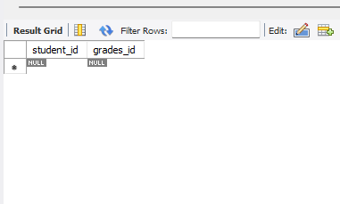
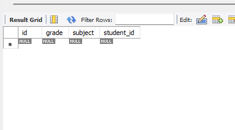
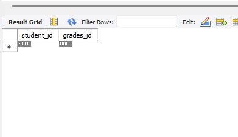
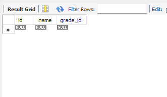
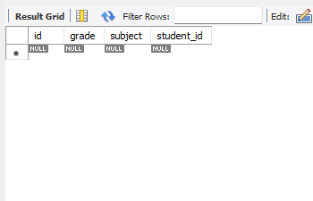
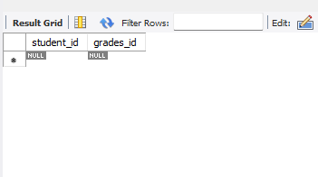
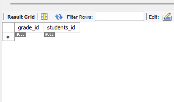

####Unidirectional one-to-many associations - introduces an additional association table
- package: oneToMany

####Unidirectional many-to-one associations - introduces an additional column on the side of the parent entity
- package: manyToOne

####Bidirectional one-to-many/many-to-one association - introduces an additional association table
- package: oneToManyManyToOne

####Unidirectional one-to-one association - introduces an additional column on the side of the parent entity
- package: oneToOne

####Bidirectional one-to-one association - introduces an additional column the on both side

- package oneToOneOneToOne

####Unidirectional many-to-many associations - introduces an additional association table

- package manyToOne

####Bidirectional many-to-many associations - introduces an additional association table the on both side

- package manyToOneManyToOne

*Note: A conflict will occur when you start the application. At startup, the project should contain only one of the relevant sample packages!*